# Projet DevOps · velos-api

**Nom et prénom :** YESSOUF Andilath
**Groupe :** <M2DAN26.1>
**Dépôt :** https://github.com/Hayerath/velos-api
**Image publiée :** docker.io/adouke/velos-api:1.0
**Date de rendu :** 28/08/2026

---

## 1. Ce que j'ai construit

J'ai repris l'application `velos-api` fournie et construit toute la chaîne de livraison autour : un dépôt Git avec un historique tracé (branches, pull requests, conflit résolu, branche protégée), une image Docker construite en plusieurs étages (avec un étage de tests dédié), une pile Docker Compose associant l'API et une base PostgreSQL, un déploiement Kubernetes complet (base, API, secret, configmap, sondes, mise à l'échelle), et enfin un pipeline Jenkins versionné qui teste, construit, publie et déploie automatiquement à chaque envoi sur GitHub. J'ai ajouté la route `/alertes` en cours de route (jalon 3), publiée en version 2.0, et démontré une mise à jour sans coupure ainsi qu'un retour arrière.

## 2. Le trajet d'une requête

Quand le navigateur appelle `http://localhost:8081/stations`, la requête arrive d'abord sur le port 8081 de ma machine, mappé par kind vers le port 30081 du nœud `control-plane` du cluster (configuré dans `kind-config.yaml`). Le `Service` Kubernetes `velos-api` (type `NodePort`) reçoit la requête et la répartit vers l'un des pods de l'API disponibles (sélectionnés via l'étiquette `app: velos-api`, en fonction de la sonde de disponibilité `readinessProbe` sur `/sante`). Le pod exécute le code Flask, qui lit la variable d'environnement `DATABASE_URL` (construite à partir du secret `velos-db-secret`) et se connecte au `Service` interne `velos-base` (type `ClusterIP`, résolu par le DNS interne du cluster grâce au nom du service). Ce service redirige vers le pod PostgreSQL, qui exécute la requête SQL et renvoie les données, qui remontent ensuite la même chaîne jusqu'au navigateur.

---

## 3. Jalon 1 · Git

**Ce que j'ai fait :** Dépôt initialisé en local avec le code fourni, `.gitignore` créé avant tout commit de code, historique construit avec des messages clairs sur des branches nommées (`feature/documentation`, `feature/docker-jalon2`, `feature/kubernetes-jalon3`, etc.), dépôt distant créé sur GitHub et relié en SSH, pull requests ouvertes avec commentaires de revue puis fusionnées, branche `main` protégée (refus des envois directs et des approbations d'auteur unique désactivée puisque je travaille seul), tag `v1.0.0` posé sur la version conteneurisée.

**Le conflit :** Le conflit a été provoqué volontairement sur le commentaire de la route `/alertes` dans `app.py` : une branche (`conflit/seuil-alerte-v1`) proposait de préciser un seuil de 2 vélos, une autre (`conflit/seuil-alerte-v2`) proposait 3 vélos, sur la même ligne du fichier. En fusionnant les deux dans `main`, Git a détecté le conflit (marqueurs `<<<<<<<`, `=======`, `>>>>>>>`). J'ai tranché en faveur du seuil de 2, car c'est la valeur explicitement imposée par le cahier des charges ("inférieur ou égal à deux").

**Ce que je retiens :** La protection de branche seule ne suffit pas si on ne désactive pas le contournement pour les administrateurs — ma première tentative de test de protection est passée malgré la règle active, à cause de l'option "bypass" cochée par défaut pour le propriétaire du dépôt.

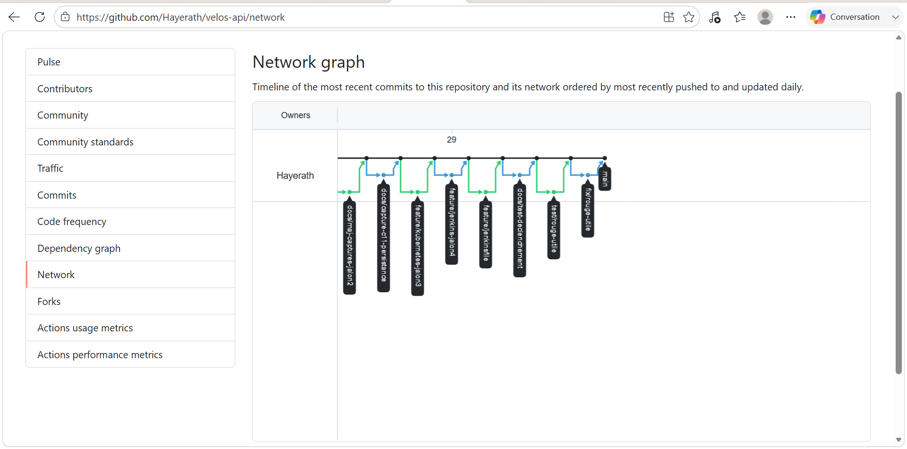
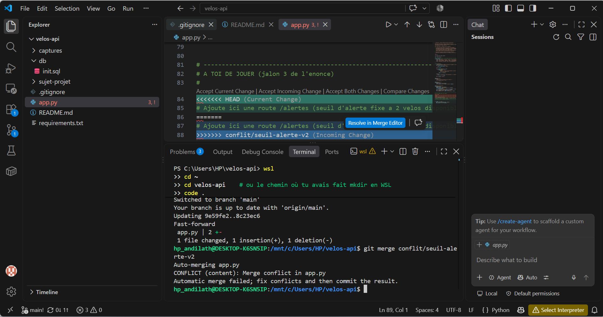
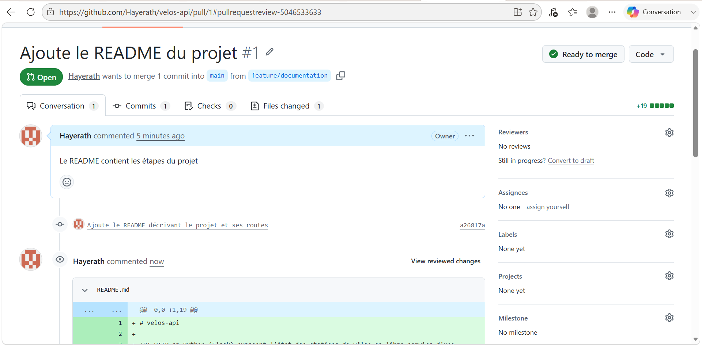
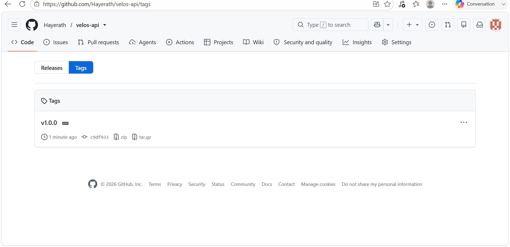
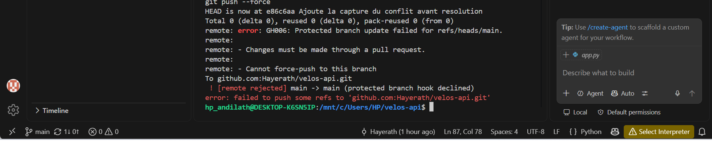

---

## 4. Jalon 2 · Docker

**Mesure du cache de construction**

| Situation | Durée mesurée |
| --- | --- |
| Construction avec les dépendances copiées après le code | 29,7 s |
| Construction avec les dépendances installées avant le code | 7,5 s |

**Taille de l'image**

| Version | Taille |
| --- | --- |
| Version naïve, un seul étage | 1.64 GB |
| Version finale, plusieurs étages | 195 MB |

**Ce que le fichier d'exclusion de construction évite d'envoyer :** Le `.dockerignore` évite d'envoyer au démon Docker l'historique Git (`.git`), les captures d'écran, le dossier de référence du sujet, les fichiers Docker eux-mêmes, ainsi que les environnements virtuels et fichiers compilés Python — ce qui accélère le transfert du contexte de build et évite de fuiter des fichiers inutiles ou sensibles dans les couches de l'image.

**Comment j'ai prouvé la persistance :** J'ai ajouté une station reconnaissable ("Test Persistance XYZ") directement dans la base via `docker compose exec base psql`, vérifié sa présence via l'API, puis détruit complètement les conteneurs avec `docker compose down` (sans supprimer le volume), remonté la pile avec `docker compose up -d`, et vérifié que la donnée était toujours présente dans la réponse de l'API — ce qui confirme que le volume nommé survit à la destruction des conteneurs.

**Ce que je retiens :** L'ordre des instructions dans un Dockerfile a un impact direct et mesurable sur le temps de reconstruction grâce au cache de couches ; copier les dépendances avant le code applicatif est une pratique qui change concrètement le temps de développement (facteur ~4 dans mon cas).

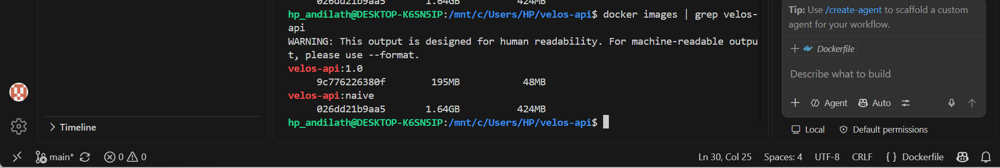
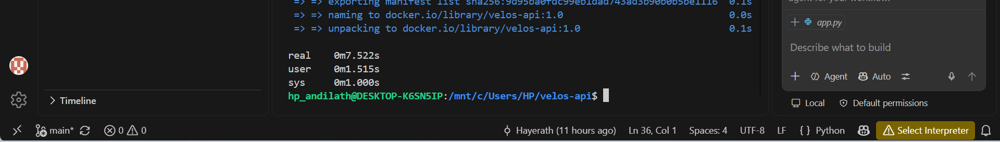
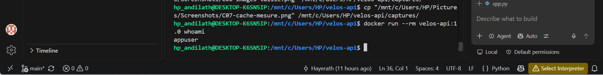
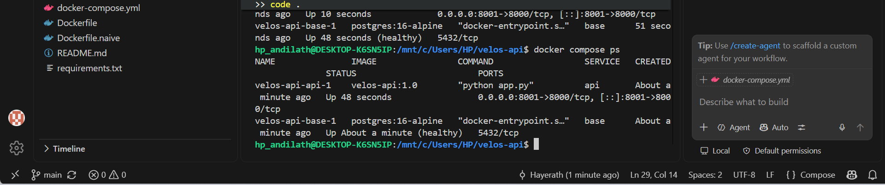
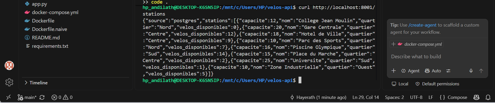
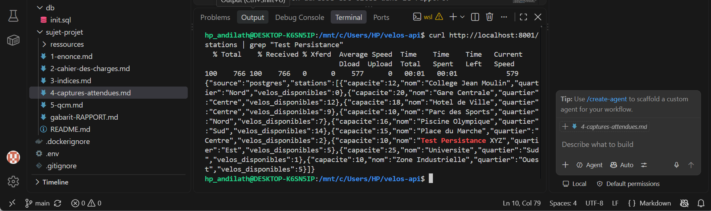

---

## 5. Jalon 3 · Kubernetes

**Comment j'ai obtenu le port 8081 vers le cluster :** Comme le cluster kind ne peut pas recevoir de mapping de port après sa création, j'ai écrit un fichier `kind-config.yaml` versionné dans le dépôt, déclarant un `extraPortMappings` reliant le port 30081 du conteneur `control-plane` au port 8081 de ma machine hôte, puis j'ai recréé le cluster avec `kind create cluster --config kind-config.yaml`. Le `Service` de l'API utilise ensuite `nodePort: 30081` pour faire le lien final.

**Où vit le mot de passe, et pourquoi ce n'est pas un coffre-fort :** Le mot de passe de la base vit dans un `Secret` Kubernetes (`velos-db-secret`), créé directement en ligne de commande avec `kubectl create secret generic ... --from-literal=password=...`, sans jamais passer par un fichier commité. Ce n'est cependant pas un coffre-fort au sens strict : la valeur n'est qu'encodée en base64 dans `etcd`, pas chiffrée, et reste lisible par quiconque a accès en lecture au secret dans le cluster (`kubectl get secret ... -o jsonpath` la révèle immédiatement).

**Ce que j'ai observé en supprimant un exemplaire sous trafic :** En supprimant un pod de l'API pendant qu'une boucle de requêtes continue interrogeait `/sante`, le trafic n'a montré aucune interruption (les autres réplicas ont continué à répondre), et un nouveau pod a été recréé automatiquement en quelques secondes par le contrôleur du Deployment, qui maintient en permanence le nombre de réplicas déclaré.

**La mise à jour vers la version 2 :** Pendant `kubectl set image deployment/velos-api api=adouke/velos-api:2.0` suivi de `kubectl rollout status`, le trafic continu vers `/sante` a continué de répondre `200` sans interruption, pendant que les pods étaient remplacés progressivement un par un (stratégie de mise à jour progressive par défaut de Kubernetes).

**Le retour arrière :** `kubectl rollout undo deployment/velos-api` a restauré la version précédente ; `kubectl rollout history` montre l'historique des révisions. J'ai vérifié le retour effectif en interrogeant `/alertes`, qui est repassée en erreur 404 (route absente de la version 1.0), confirmant que le rollback avait bien réussi.

**Ce que je retiens :** Le nom du service (pas `localhost`) est la seule façon fiable de joindre un autre pod dans le cluster, grâce au DNS interne ; et la sonde de disponibilité (`readinessProbe`) est ce qui permet à Kubernetes de ne jamais envoyer de trafic vers un pod qui n'est pas encore prêt.

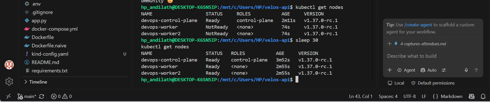
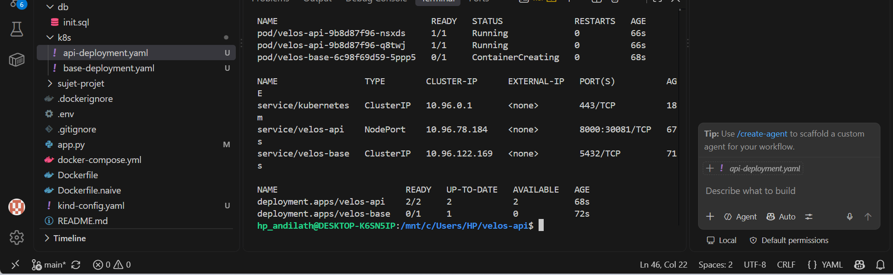
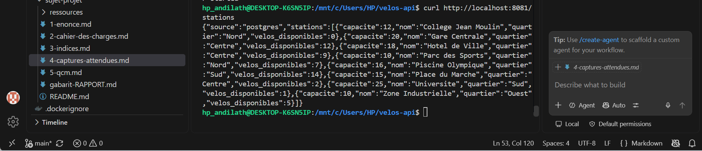
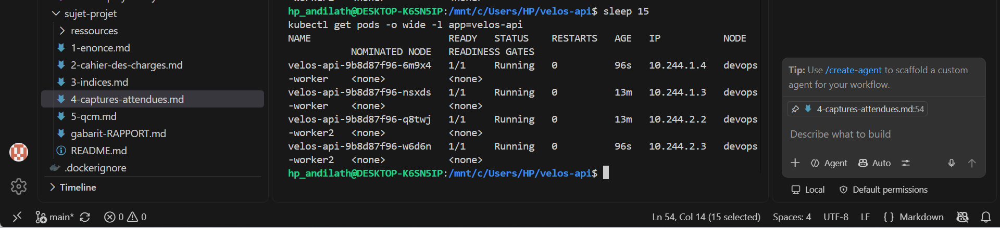
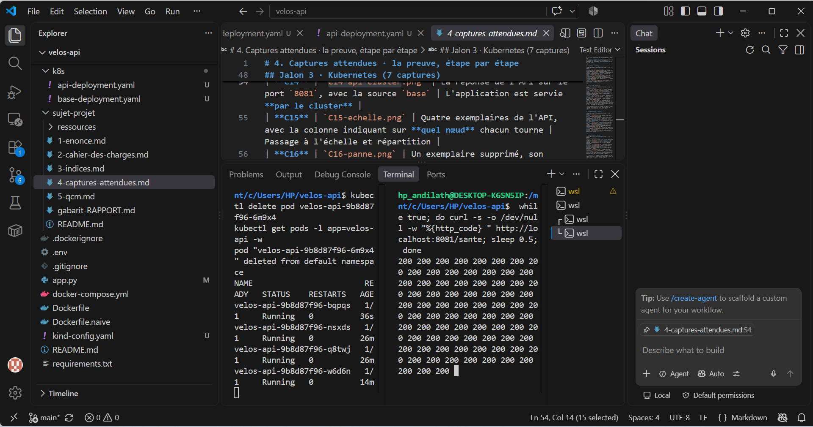
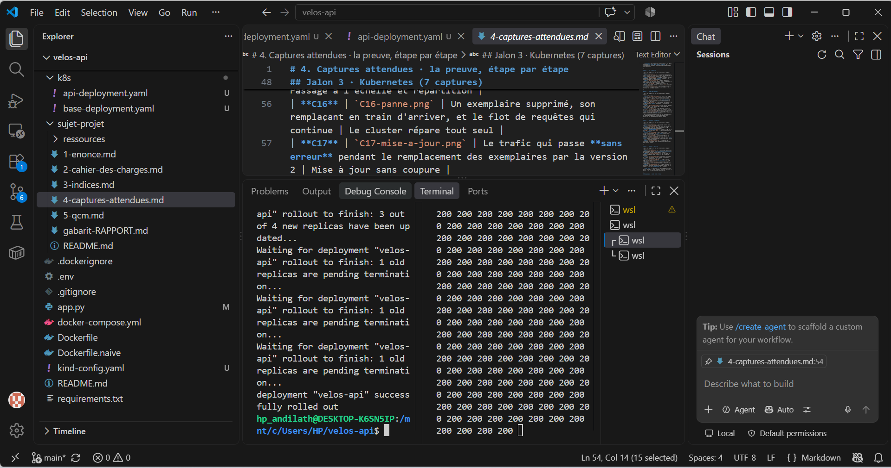
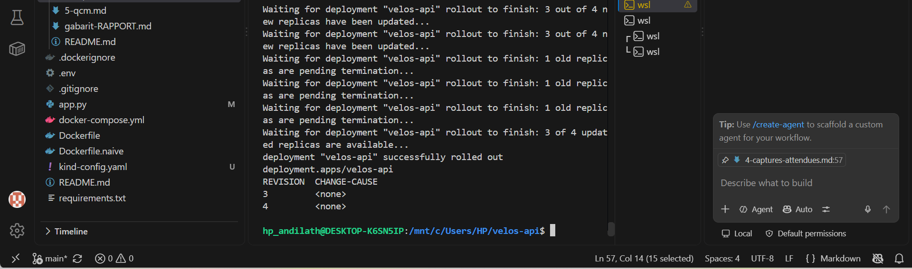

---

## 6. Jalon 4 · Jenkins

**Mes tests :** Deux tests (`test_sante`, `test_alertes_seuil`) vérifient respectivement la route `/sante` et la route `/alertes`. Ils n'ont besoin d'aucune base de données car, en l'absence de la variable d'environnement `DATABASE_URL`, l'application retombe automatiquement sur son jeu de données en mémoire (`source: "memoire"`) — ce comportement est justement celui que le deuxième test vérifie.

**Les quatre étapes de mon pipeline :** Tester (construction de l'étage `test` du Dockerfile, qui exécute `pytest`) → Construire (construction complète de l'image finale) → Publier (connexion et envoi vers Docker Hub via les identifiants Jenkins) → Déployer (mise à jour de l'image du déploiement Kubernetes et attente de la fin réelle du rollout).

**Comment mes images sont étiquetées, et pourquoi :** Chaque image est étiquetée `${BUILD_NUMBER}-${GIT_COMMIT court}`, par exemple `adouke/velos-api:5-32bbc0a`. Ça permet de relier immédiatement une image en service au numéro d'exécution Jenkins qui l'a produite ET au commit exact qui en est à l'origine, ce qui facilite le diagnostic en cas de problème.

**La ligne qui rend mon pipeline honnête :** `kubectl rollout status deployment/velos-api --kubeconfig=$KUBECONFIG --timeout=90s`. Cette ligne attend que le déploiement soit réellement terminé (tous les nouveaux pods prêts) et fait échouer le pipeline si ce n'est pas le cas après 90 secondes. Sans elle, la commande précédente (`kubectl set image`) rendrait la main immédiatement après avoir simplement enregistré la demande de changement, sans aucune garantie que les nouveaux pods démarrent correctement — le pipeline se déclarerait vert même en cas d'échec silencieux du déploiement.

**Le rouge utile :** J'ai cassé volontairement l'assertion du test `test_alertes_seuil` (`donnees["source"] == "XXX"` au lieu de `"memoire"`). Le pipeline a échoué dès l'étape Tester, les étapes Construire/Publier/Déployer ont été marquées "skipped due to earlier failure(s)", et j'ai vérifié avec `kubectl get deployment velos-api -o jsonpath=...` que l'image en service dans le cluster était restée celle du dernier build réussi. J'ai ensuite corrigé le test et repoussé : le pipeline est redevenu vert automatiquement.

**L'extrait de journal qui donne la cause :**

```
test_app.py::test_alertes_seuil FAILED                                   [100%]
AssertionError: assert 'memoire' == 'XXX'
  - XXX
  + memoire
```

**Ce que je retiens :** Un pipeline CI/CD n'a de valeur que si chaque étape peut réellement bloquer les suivantes ; le point le plus facile à oublier (et le plus important) est de vérifier que la version *en service* n'a pas changé après un échec, pas seulement que l'étape s'est affichée en rouge.

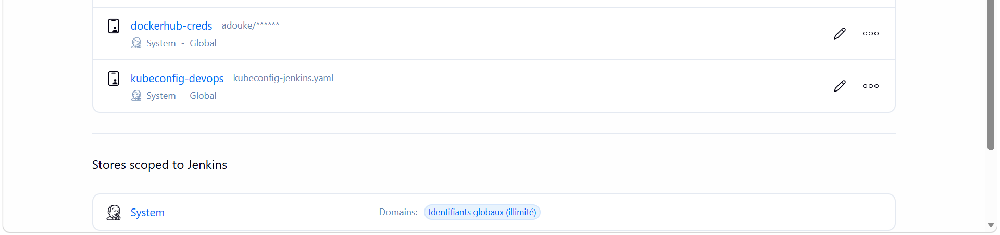
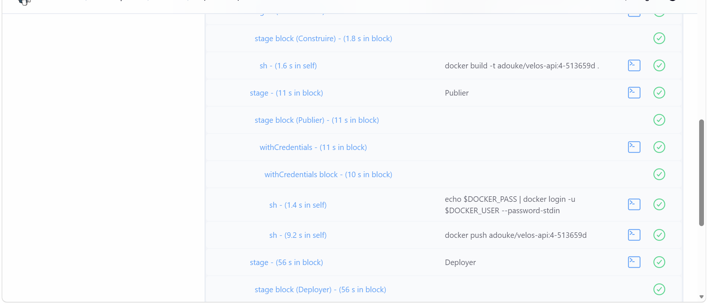
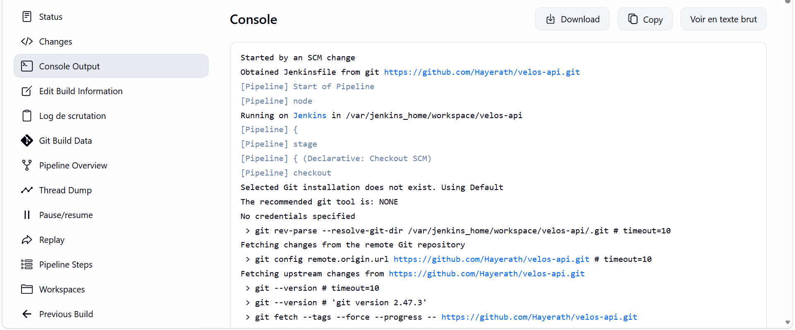
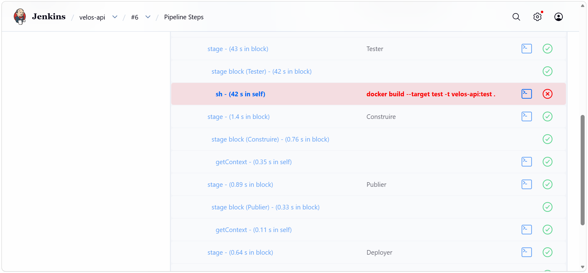
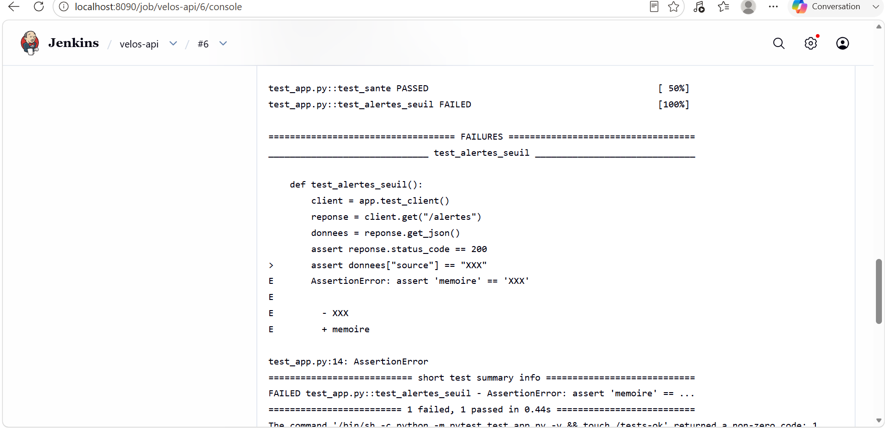
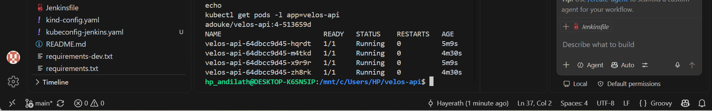

---

## 7. Mes trois difficultés

| # | Symptôme observé | Cause réelle | Correction apportée |
| --- | --- | --- | --- |
| 1 | `kind` créé au TP5 était incompatible avec le port 8081 demandé | Le mapping de port ne peut pas être ajouté après la création d'un cluster kind | Écriture d'un `kind-config.yaml` versionné avec `extraPortMappings`, et recréation complète du cluster |
| 2 | `docker login` échouait avec "incorrect username or password" dans Jenkins malgré un mot de passe correct | Docker Hub exige un token d'accès plutôt qu'un mot de passe classique pour les connexions via API/CLI | Génération d'un token d'accès Docker Hub dédié, utilisé comme "password" dans le credential Jenkins ; l'ancien token accidentellement exposé a été révoqué immédiatement |
| 3 | L'étage `test` du Dockerfile ne s'exécutait jamais malgré sa présence dans le fichier | Docker BuildKit ne construit que les étages dont dépend explicitement l'étage final (via `COPY --from=...`) ; sans lien, l'étage `test` était simplement ignoré | Ajout d'un fichier marqueur `/tests-ok` créé à la fin de l'étage `test`, copié explicitement dans l'étage final avec `COPY --from=test /tests-ok /tests-ok`, forçant Docker à réellement exécuter les tests avant de continuer |

---

## 8. Ce qui n'est pas fait

Un vrai webhook GitHub (remplacé par un Poll SCM faute d'exposition publique de Jenkins)

---

## 9. Assistance utilisée

J'ai utilisé Claude pour comprendre les messages d'erreur rencontrés (WSL/VS Code, connexions Kubernetes, échecs Docker Hub), pour structurer les manifestes Kubernetes et le Jenkinsfile à partir des concepts vus en TP, et pour vérifier la cohérence de ma démarche par rapport au cahier des charges. 

---

## 10. Si j'avais deux jours de plus

 Mettre en place un vrai webhook GitHub via un tunnel, ajouter une sonde de vivacité (liveness probe) en plus de la sonde de disponibilité, déclarer des limites de ressources sur les conteneurs, ajouter une étape d'analyse de vulnérabilités dans le pipeline.>
